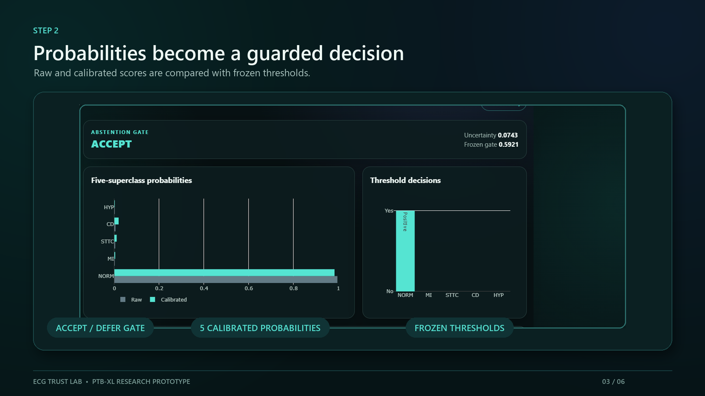

# Trustworthy 12-lead ECG classification on PTB-XL

This project compares a 1D residual network with a patch-based ECG transformer on PTB-XL, then evaluates what matters beyond headline discrimination: probability calibration, selective abstention, subgroup behavior, robustness, and explanation faithfulness.

The canonical task is **multi-label prediction of the five PTB-XL diagnostic superclasses** (NORM, MI, STTC, CD, and HYP). The local demo is a research-only interface that loads a compatible 12-lead ECG, shows calibrated probabilities and an abstention decision, and highlights waveform regions associated with each output.

Start with the concise [build order](docs/BUILD_ORDER.md) or the full
[research and implementation blueprint](docs/RESEARCH_BLUEPRINT.md). The
[data card](docs/DATA_CARD.md) records the verified dataset contract, and the
[completed r3 model card](docs/MODEL_CARD_PTBXL_SUPERCLASS_R3.md) separates the
sealed fold-10 result from post-evaluation descriptive audits. The
[development report](reports/DEVELOPMENT_RESULTS.md) is retained as a
historical pre-evaluation snapshot. A concise
[portfolio case study](docs/PORTFOLIO_CASE_STUDY.md) explains the full project,
result, limitations, and résumé-ready summary without requiring ML expertise.
The [sanitized public result snapshot](reports/FINAL_RESULTS_PUBLIC.md) links
the identifier-free aggregate tables and figures that can safely accompany a
source-only clone. The later [frozen SPH transport protocol](docs/EXTERNAL_TRANSPORT_SPH_R2.md),
[sanitized SPH result](publication/external_transport_sph_r2/FINAL_RESULTS.md),
and [independent artifact audit](reports/SPH_EXTERNAL_TRANSPORT_AUDIT.md)
document a separate retrospective external-transport stress test of the same
six frozen members.

## Demo walkthrough

[](publication/media/ecg-trust-lab-research-demo.mp4)

The linked [29.5-second silent walkthrough](publication/media/ecg-trust-lab-research-demo.mp4)
shows the frozen model state, calibrated probabilities, accept/defer gate,
12-lead waveform, and Grad-CAM sensitivity overlay. It is a research-interface
demonstration, not a clinical-use demonstration.

## Current status

- PTB-XL 1.0.3 100 Hz is downloaded: 21,799 records and 43,605 selected files
  pass the official SHA-256 inventory.
- The immutable task manifest contains 21,388 labeled ECGs from 18,617
  patients; all official source, label, fold, file, and patient-isolation gates
  pass.
- Train-only normalization is frozen from 14,955 records in folds 1–7 with
  provenance hash `55dd86001dee2006cb241ff8b4f3970d8fcbb1ae9ecd430f5dd61478673ce235`.
- Project-local Python 3.12.13, PyTorch 2.13.0 + CUDA 13.0, cuDNN 9.2, and BF16
  pass the real RTX 5070 Ti forward/backward check.
- The matched 12-candidate sweep, paired seeds 2026/2027/2028 confirmation,
  architecture freeze, and all six fresh folds-1–8 refits are complete. Fold 8
  selected the ResNet as the development primary; those selection results
  remain distinct from the final test.
- Fold-9 calibration and decision fitting are sealed. The one-time exact-six
  fold-10 batch completed on August 9, 2026 UTC under its global ledger. Across
  seeds, mean +/- sample SD macro AUROC was `0.921921 +/- 0.000913` for the
  ResNet versus `0.897420 +/- 0.003270` for the transformer.
- Within every seed, paired patient-bootstrap intervals favored the ResNet for
  macro AUROC, average precision, and Brier score. All paired ECE intervals
  crossed zero, and fixed-bin bootstrap ECE requires an additional binning
  caveat; no ECE advantage is claimed.
- The frozen r2 SPH run is complete. It evaluated the same six members once,
  with no SPH tuning or recalibration, on 18,842 exact-10-second ECGs from
  18,157 patients. The primary directly mapped cohort contained 15,698 ECGs
  from 15,193 patients; calibrated macro AUROC was
  `0.930912 +/- 0.000964` for the ResNet and `0.924088 +/- 0.001231` for the
  transformer. This is an exploratory retrospective transport stress test,
  not clinical validation; its cross-ontology map was not clinically
  adjudicated, and MI and HYP are rare.
- The immutable r3 post-evaluation package is complete: calibrated reliability,
  dense risk-coverage, subgroup coverage, 246 controlled-corruption
  member-cases, and 900 explanation-control evaluations. Age 80+ was notably
  under-covered by the global abstention gates; corruptions and saliency remain
  descriptive sensitivity tests, not clinical validation.
- The local FastAPI/Plotly research viewer is bound to the frozen ResNet seed
  2026 checkpoint, fold-9 policy, and r3 label-free examples. An isolated
  Chromium replay verified ordinary inference and Grad-CAM across the rendered
  12-lead waveform with no console error or failed request; details are in the
  [post-evaluation run log](reports/POST_EVALUATION_RUN_LOG.md).
- The historical August 9 r3 repository gate passed all 434 tests, Ruff, and
  strict mypy. The current post-SPH repository gate separately passed all 494
  tests, Ruff, and strict mypy. Pytest emitted one upstream Starlette/httpx
  deprecation warning.
- [DEV-001](reports/PROTOCOL_DEVIATIONS.md) records bounded pre-evaluation
  exposure of raw fold-10 label-bearing metadata rows. No waveform,
  prediction, model metric, or exposed value informed a choice, but strict
  operator-level outcome-label blindness was breached. This project does not
  claim a completely blind test.
- The failed r1 and r2 post-evaluation trees remain immutable. r3 binds both
  supersessions and regenerated every derived artifact without reuse; see the
  [post-evaluation run log](reports/POST_EVALUATION_RUN_LOG.md).

## Repository contents

The repository tracks source code, frozen configuration, tests, documentation,
run logs, and small publication figures. Patient data, local environments,
checkpoints, predictions, and generated run trees are intentionally excluded
from Git. A fresh clone therefore does **not** contain PTB-XL records or trained
weights. Use the [reproducibility guide](docs/REPRODUCIBILITY.md) to reconstruct
the pipeline from the official dataset; do not treat the repository as a
downloadable clinical model.

## Development commands

Run these commands from the project directory:

```powershell
uv sync --all-groups
uv run ecg-verify
uv run python scripts/smoke_dataset.py
uv run python scripts/benchmark_models.py --help
uv run python scripts/train.py --config configs/train_smoke.yaml
uv run python scripts/sweep.py preflight
uv run python scripts/sweep.py status
uv run python scripts/multiseed.py --help
uv run python scripts/freeze_multiseed.py --help
uv run python scripts/refit.py --help
uv run python scripts/release_pipeline.py --help
uv run python scripts/build_subgroups.py --help
uv run python scripts/predict.py --help
uv run python -m ecg_trust.calibration_cli --help
uv run python scripts/demo_server.py --help
uv run pytest
uv run ruff check src tests scripts
uv run mypy
```

See the [verified environment record](docs/ENVIRONMENT.md) for exact versions
and CUDA details, and [reproducibility guide](docs/REPRODUCIBILITY.md) for the
complete artifact flow.

## Dataset attribution

PTB-XL 1.0.3 is provided by Wagner et al. through PhysioNet under CC BY 4.0.
The [data card](docs/DATA_CARD.md) records the dataset authors, DOI, license,
release checksums, and required attribution. Raw PTB-XL files are not
redistributed in this repository; the included derived waveform visualizations
remain subject to the dataset's CC BY 4.0 attribution requirements.

The external stress test uses the SPH dataset described by Liu et al.
([paper](https://doi.org/10.1038/s41597-022-01403-5),
[Figshare collection](https://doi.org/10.6084/m9.figshare.c.5779802.v1)). Its
Figshare source items are marked CC0. Raw SPH files are also Git-ignored and
not redistributed; exact source hashes are recorded in the
[frozen transport protocol](docs/EXTERNAL_TRANSPORT_SPH_R2.md).

## Scope statement

This is a research and educational system, not a medical device. The SPH result
is limited retrospective external-transport evidence, not prospective or
clinical validation. Outputs must not be described as diagnoses, clinical
recommendations, or evidence of real-world clinical safety.
