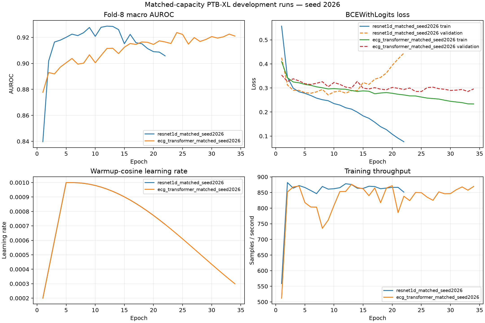

# Development results

> **Historical pre-evaluation snapshot — not the current project status.**
> This file is preserved without rewriting its original fold-8 numbers or
> then-current stage language. Statements below that fold-9 calibration or
> fold-10 evaluation is pending describe the time when this snapshot was
> written. The sealed final result is in
> `runs/post_evaluation/ptbxl_matched_equal_budget_v1__audit-r3/reports/FINAL_RESULTS.md`,
> the completed interpretation is in
> `docs/MODEL_CARD_PTBXL_SUPERCLASS_R3.md`, and the immutable post-evaluation
> history is in `reports/POST_EVALUATION_RUN_LOG.md`.

**Status:** paired three-seed model-selection evidence and frozen refits complete;
fold-9 calibration pending

**Protocol:** PTB-XL 1.0.3, 100 Hz, folds 1–7 train, fold 8 model selection  
**Confirmation seeds:** 2026, 2027, 2028
**Labels:** NORM, MI, STTC, CD, HYP

These numbers are not fold-10 test results and are not final research claims.
They establish the frozen architecture decision and refit budgets used for the
next stage. Fold 9 and fold 10 were not accessed by any reported run. A bounded
sample of raw metadata rows containing some fold-10 SCP codes was accidentally
displayed during a later pre-evaluation audit; no model output or aggregate
metric was exposed or used. This operator-blinding deviation is recorded in
`reports/PROTOCOL_DEVIATIONS.md` and must accompany the final claims.

## Paired multi-seed confirmation and architecture freeze

All six preregistered architecture/seed members completed on the same aligned
fold-8 records. Scores below were independently recomputed from immutable
prediction artifacts; the one nonzero training-receipt difference was
`0.0000001242`, inside the predeclared absolute tolerance of `0.000001`.

| Model | Seed 2026 | Seed 2027 | Seed 2028 | Mean fold-8 macro AUROC | Frozen refit epochs |
|---|---:|---:|---:|---:|---:|
| 1D ResNet | 0.931852 | 0.932127 | 0.932540 | 0.932173 | 12 |
| ECG transformer | 0.923927 | 0.916589 | 0.912838 | 0.917785 | 22 |

The paired mean difference, transformer minus ResNet, was `-0.014388`.
Under the preregistered practical-margin rule of `0.005`, the immutable
development decision is `resnet1d_selected`. ResNet is therefore the primary
architecture for headline ordering and the research demo, while both
architectures and all three seeds remain frozen comparators. Fold-9 or fold-10
results cannot change this selection.

The authoritative freeze artifact is
`runs/confirmation/ptbxl_matched_equal_budget_v1/multiseed_freeze.json`, with
artifact SHA-256
`49a64102d3461bdeb0b932f23b6b8dd8f80e4a5b6c7947ae4da4f3c8c6ab4690`.
Its paired seed differences were `-0.007925`, `-0.015538`, and `-0.019702`
for seeds 2026, 2027, and 2028, respectively.

## Frozen folds-1–8 refits

Six fresh-weight refits completed from the immutable freeze: three ResNets for
12 epochs and three transformers for 22 epochs. Each used exactly folds 1–8,
retained normalization fitted only on folds 1–7, and performed no validation,
early stopping, or checkpoint selection. Every completion receipt re-verifies
its source confirmation member, recipe, freeze, code revision, dependency
lock, resolved configuration, checkpoint, manifest, and normalization.

The six-member release bundle is
`runs/release/ptbxl_matched_equal_budget_v1/refit_bundle.json`, with artifact
SHA-256
`7a0bbd07bfeec1cfb68599829921fee0ad4a3d97968520c43c952f1ea3bb59dd`.
It passed full source re-verification and is the only authorized input to the
future fold-9 export. No refit metric is reported because the refits deliberately
had no model-selection fold.

## Equal-budget paired sweep

Both architectures completed the same immutable 12-row Latin-hypercube
candidate plan with a fixed seed of 2026, a 30-epoch ceiling, identical data
roles, no pruning, and alternating first-model order. A machine-verified sweep
summary confirms 12 unique complete candidates for each architecture. One
ResNet attempt was interrupted by the terminal transport, marked failed, and
retried with the identical candidate and seed; it reproduced the partial
history exactly and did not consume the candidate budget.

| Model | Winning candidate | Best epoch | Completed epochs | Fold-8 macro AUROC | Peak allocated VRAM | Runtime | Batch | Learning rate | Weight decay |
|---|---:|---:|---:|---:|---:|---:|---:|---:|---:|
| 1D ResNet | 11 | 12 | 22 | 0.931852 | 455.4 MiB | 382.6 s | 128 | 0.00242420 | 0.0000147610 |
| ECG transformer | 6 | 21 | 30 | 0.923927 | 1,204.6 MiB | 793.6 s | 192 | 0.00123597 | 0.00141241 |

The seed-2026 development difference is 0.007925 macro-AUROC in favor of the
ResNet. It was only one input to the paired three-seed architecture decision
reported above; it was not used to select a best seed.

The final sweep summary is identified by SHA-256
`04574c17773dea894efd84bf2ed5fa5be685ce3a6687deb3524a373ea6d8df6b`.
Its shared candidate-plan hash is
`fd1c140be07f8f99d1655c21e8986bac6759c1838be438e22fd18c475a51f8f7`.
The exact winner checkpoints are:

- ResNet candidate 11: `5eaa84fa5f47a66cbd4f9ccc3bb5fea75f7abf2a6ff31bff288d90ba9089cd97`
- Transformer candidate 6: `004cf4be1d423fbdb4828f098467d0747b73c25df6c86678ced1186d2b87a476`

The verified sweep-winner training-curve figure is generated at
`artifacts/figures/sweep_winner_training_curves.png`.

## Initial matched-capacity comparison

| Model | Parameters | Best epoch | Completed epochs | Macro AUROC | Macro AUPRC | Brier | ECE | Peak allocated VRAM | Train time |
|---|---:|---:|---:|---:|---:|---:|---:|---:|---:|
| 1D ResNet | 8,739,973 | 12 | 22 | 0.9287 | 0.8261 | 0.0841 | 0.0379 | 457.9 MiB | 389.6 s |
| ECG transformer | 8,726,833 | 24 | 34 | 0.9237 | 0.8050 | 0.0879 | 0.0301 | 868.0 MiB | 618.1 s |

The capacity gap is 0.1503%, well inside the preregistered ±15% tolerance.
Both runs used batch 128, BF16, AdamW, the same warmup-cosine schedule, the same
train-only normalization, and the same early-stopping rule. Mean observed
training throughput was approximately 852 records/s for the ResNet and 830
records/s for the transformer; first-epoch initialization is included.

## Per-label metrics at each model's selected epoch

| Model | Label | AUROC | AUPRC | Brier | ECE |
|---|---|---:|---:|---:|---:|
| ResNet | NORM | 0.95 | 0.93 | 0.09 | 0.04 |
| ResNet | MI | 0.93 | 0.85 | 0.09 | 0.04 |
| ResNet | STTC | 0.93 | 0.82 | 0.09 | 0.03 |
| ResNet | CD | 0.93 | 0.85 | 0.08 | 0.03 |
| ResNet | HYP | 0.91 | 0.67 | 0.07 | 0.04 |
| Transformer | NORM | 0.95 | 0.93 | 0.09 | 0.04 |
| Transformer | MI | 0.92 | 0.83 | 0.09 | 0.02 |
| Transformer | STTC | 0.93 | 0.79 | 0.09 | 0.02 |
| Transformer | CD | 0.91 | 0.81 | 0.09 | 0.03 |
| Transformer | HYP | 0.91 | 0.66 | 0.07 | 0.04 |

Rounded per-label values are for orientation; machine-readable histories and
checkpoints under `runs/development/` retain full precision and complete
provenance. The initial comparison motivated the matched sweep above. The
final architecture comparison still requires paired patient-cluster
confidence intervals on the single authorized fold-10 batch. The fold-8
decision above selects the development primary but is not a final-test claim.

## Selected checkpoint SHA-256

- ResNet: `9051b829d556fd5824f1f52463654f620ca77a075a0653c6407012bece72f8dd`
- Transformer: `9199dc9243cce5f348c1bcd7ffd3d88bc259a74085ab2f7663b9707d5e1fa09a`

The checkpoints are local, gitignored artifacts. These digests identify the
exact files used for any later development-fold export or frozen refit.
