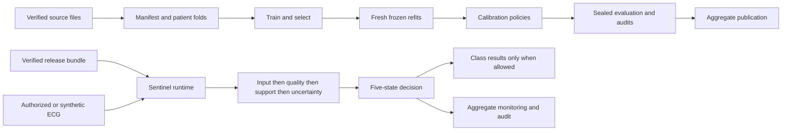

# Repository research review and delivery plan

Date: 2026-09-16. Reviewed main revision: `7127977`. Engineering baseline:
PR [#8](https://github.com/Ahmad986Ferdaws/ecg-trust-lab/pull/8), revision
`33f74f6d40102121cf58c7bc519060711120aded`.

This investigation used the Research My Way cycle: state a hypothesis,
reproduce it on synthetic inputs, compare against a competing explanation,
then change the smallest relevant component. Five confirmed engineering
failures are addressed in independent pull requests. They improve contract
integrity and numerical reliability; they do not improve or re-estimate any
reported model performance.

## How the repository works

The application has three related but distinct products: a completed scientific
comparison, development infrastructure for Sentinel assurance, and a public
aggregate-results experience. Their evidence and release states must stay distinct.

| Layer | Principal source | Data flow and invariant |
| --- | --- | --- |
| Dataset identity | `data/manifest.py`, `data/dataset.py`, `constants.py` | Verify source inventory and patient-safe folds; map diagnostic statements to five overlapping superclass targets; load canonical 12-lead physical signals. Normalization has train-only provenance. |
| Model comparison | `models/resnet1d.py`, `models/transformer.py`, `training.py`, experiment/sweep/multiseed/refit runners | The CNN uses residual temporal convolutions; the transformer uses temporal patches and attention. Both produce five logits and train with binary cross-entropy. Selection, confirmation, and fresh refits are separate stages. |
| Prediction provenance | `predictions.py`, `prediction_export.py` | Non-pickled NPZ arrays and hashed JSON sidecars bind row identity, labels, folds, configuration, and producer metadata. Paired comparisons require aligned records. |
| Calibration and decisions | `evaluation.py`, `decisioning.py`, `release_gates.py` | Fit calibration and decision policies on permitted source roles; apply frozen policies downstream. Calibration and final evaluation have separate authorization and provenance. |
| Sealed evidence | `final_batch.py`, `post_evaluation.py`, `audit.py`, `sph_transport.py` | The exact-six final batch is governed by an opening ledger and immutable plan. Patient-level paired uncertainty and descriptive audits remain distinct from model selection. SPH is a separate frozen transport test. |
| Sentinel assurance | `quality/`, `open_world/`, `conformal/`, `trust_policy.py`, `sentinel_engine.py` | Validate physical input, quality, source support, and uncertainty independently. Only `PREDICTION_ALLOWED` carries class outputs. Missing evidence closes the gate. |
| Release and service | `registry/`, `runtime_binding.py`, `service/` | Bind components to verified release artifacts; accept opaque authorized/synthetic case identifiers. Sanitize failures and withhold labels on abstention. |
| Operations | `monitoring/`, `audit_log/` | Compare aggregate windows against a frozen reference and recommend governance actions. The ledger verifies canonical bytes, hash chaining, and checkpoints. Neither module automatically retrains models. |
| Research scaffolds | `foundation/`, `longitudinal/`, `counterfactual/`, `human_factors/`, `data/multisite.py` | Contracts for possible future studies. Their existence is not completed validation or a reason to begin parked studies. |
| Presentation | `demo_app.py`, `demo_backend.py`, `results-experience/` | The historical inference demo and the aggregate publication site serve different purposes. The React/WebGL site displays audited results and a schematic waveform; it is not a patient inference service. |



The historical development split used folds 1–7 for fitting and fold 8 for
selection, followed by fresh folds-1–8 refits and fold-9 policy fitting before
the sealed fold-10 evaluation. Source-calibration preparation later separated
fold-9 patients into distinct roles. These are different protocols, not
interchangeable random train/test splits.

## Existing PR assessment

PR #8 fixes untyped trust-policy evidence and engine/release readiness before
request execution. It also adds CPU engineering CI and explicit prerequisites
for platform/private-artifact tests. This review reuses those changes instead
of duplicating them. Its engineering report is a prior review record, not an
independent rerun of historical scientific results.

The new PRs all target #8's branch so reviewers see only their own changes.
Merge #8 first, then retarget these PRs to `main`; they are independent siblings,
not a chain that requires all five fixes to land together. This investigation
does not merge, promote, or deploy a release.

## Hypotheses, experiments, and decisions

### 1. Release evidence can still pass through Python truthiness

- **Hypothesis:** hardening policy booleans in #8 did not cover the service's
  separate `VerifiedRelease` flags.
- **Prediction:** `verified="false"` or `locked="false"` will construct a release
  and let a fake provider expose a prediction. The competing explanation is
  that the boundary already enforces boolean types.
- **Observation:** construction accepted both strings; HTTP regression tests
  reached successful responses before the fix. Fourteen new cases failed.
- **Decision:** enforce real boolean fields and literal `True` release gates.
  Malformed provider output becomes a sanitized 503 before inference. The
  production registry already emits typed flags; an external HTTP exploit was
  not demonstrated.
- **Delivery:** [PR #9](https://github.com/Ahmad986Ferdaws/ecg-trust-lab/pull/9),
  commit `70ac4d8`; 14 new tests.

### 2. Conformal factories are stricter than direct construction

- **Hypothesis:** a frozen dataclass does not validate annotated types or freeze
  the contents of a supplied list. Trusted loaders can bypass factory checks.
- **Prediction:** a direct mask containing the string `"false"` can report
  `SUPPORTED`, and modifying an input list can alter constructed evidence.
  The competing explanation is a shared constructor invariant.
- **Observation:** both failures reproduced. Direct calibrators also accepted
  nonfinite/out-of-range thresholds and inconsistent quantile ranks. Fifteen
  new cases failed.
- **Decision:** validate at construction, copy nested sequences to tuples, and
  make deserialization use the same invariant. The finite-sample quantile and
  coverage scope are unchanged. The OOD runner's valid direct construction
  remains supported.
- **Delivery:** [PR #10](https://github.com/Ahmad986Ferdaws/ecg-trust-lab/pull/10),
  commit `fd9f4ee`; 15 new tests.

Python documents that dataclasses generally do not inspect annotated types,
and that frozen instances emulate immutability rather than recursively freezing
objects. That distinction motivates constructor validation here.
[Python dataclasses](https://docs.python.org/3.12/library/dataclasses.html).

### 3. Stable log-sum-exp alone does not make the energy pipeline stable

- **Hypothesis:** overflow occurs before or after `logaddexp`, despite its stable
  implementation: in normalized logits, `2*T`, or the sum preceding a mean.
- **Prediction:** finite logits and a finite positive temperature can yield an
  infinite score. The competing explanation is that validation excludes these
  inputs or the mathematical result itself is unrepresentable.
- **Observation:** the test `[[1, -1]]` with `T=1e-320` returned `-inf` although
  its representable limit is `-0.5`. Large finite logits also overflowed the
  reduction. Complex NumPy arrays silently lost their imaginary components.
- **Decision:** use `-|z|/2 - T*log1p(exp(-|z|/T))` and scale the mean; reject
  complex inputs before casting. The first attempted divide-before-sum mean
  lost one subnormal rounding unit in a zero-logit test, so it was replaced
  with a row-scaled mean. Automated review then found that separately rounded
  terms at the smallest positive float could reverse score ordering. A new
  regression reproduced that failure; dimensionless summation before rescaling
  fixes it. Ten new regression/control cases now pass.
- **Delivery:** [PR #11](https://github.com/Ahmad986Ferdaws/ecg-trust-lab/pull/11),
  commits `f058339` and `8778890`.

A comparison using NumPy generator seed `20260916`, 1,000-by-5 logits sampled
from `normal(0, 10)`, and temperatures `[0.01, 0.1, 1, 10, 100]` gave maximum
absolute differences from the original finite formula of at most
`2.842170943040401e-14`. Mathematical equivalence does not imply bitwise identity.
See [NumPy logaddexp](https://numpy.org/doc/stable/reference/generated/numpy.logaddexp.html)
and [Blanchard, Higham & Higham](https://arxiv.org/abs/1909.03469) for numerical
background; the reproduced repository failure is the evidence for this change.

### 4. A relative-path check is not a portable operand check

- **Hypothesis:** `is_absolute()` misses Windows drive-relative paths, and
  checking `PurePosixPath.parts` occurs after dot/empty-segment normalization.
- **Prediction:** `C:records100/00001`, `records100/file:stream`, `.`, and
  doubled or dot separators pass the validator. The competing explanation is
  that the lexical form is rejected before pathlib normalization.
- **Observation:** all those examples were accepted. Control characters were
  accepted too. The downstream resolved-root check is additional protection;
  this experiment does not establish an end-to-end root escape.
- **Decision:** reject those lexical operands while preserving backslash
  normalization and the checksum inventory parser's explicit `./` handling.
  Eight rejection cases failed before the fix; a compatibility control passed.
- **Delivery:** [PR #12](https://github.com/Ahmad986Ferdaws/ecg-trust-lab/pull/12),
  commit `c79b56f`; nine new tests.

The behavior of drive-relative paths is documented in
[Python pathlib](https://docs.python.org/3.12/library/pathlib.html). This is a
bounded manifest-contract fix, not a general Windows filesystem security audit.

### 5. Monitoring accepts smoothing values its arithmetic cannot handle

- **Hypothesis:** direct ratios and linear-space normalization overflow for
  accepted positive finite smoothing counts.
- **Prediction:** opposite `(100, 0)` / `(0, 100)` histograms with smoothing
  `1e-320` fail even though PSI is finite. Huge smoothing also overflows the
  denominator. The competing explanation is an invalid configuration.
- **Observation:** both valid extreme configurations failed; ordinary smoothing
  and the direct-formula control passed.
- **Decision:** normalize smoothed counts in log space and subtract logarithms
  instead of dividing proportions. Bins, severity thresholds, and governance
  actions are unchanged. Four regression/control cases pass.
- **Delivery:** [PR #13](https://github.com/Ahmad986Ferdaws/ecg-trust-lab/pull/13),
  commit `4decb7f`.

Using the same generator after the energy experiment, 1,000 pairs of ten-bin
integer counts sampled from `[0, 1000)` with smoothing `1e-6` differed from
the original direct formula by at most `5.329070518200751e-15`. The numerical
basis is addition in log space as defined by
[NumPy logaddexp](https://numpy.org/doc/stable/reference/generated/numpy.logaddexp.html).

## Validation and reproduction

Environment: macOS 26.6.2 arm64, Python 3.12.14, CPU PyTorch 2.13.0,
NumPy 2.5.3, pytest 9.1.1. An existing CPU development environment was reused;
`PYTHONPATH=src` and pytest's project configuration select this checkout's
source. Neither the CUDA dependency source nor the scientific lock was changed.

- On unchanged #8 code, the five-module suite with the new tests reported
  **46 failures and 117 passes**. The failures were the new regressions.
- The initial five-fix suite reported **163 passes**; after the three additional
  subnormal review regressions, it reported **166 passes**.
- The complete combined suite reported **1,724 passes, 110 prerequisite skips,
  two upstream deprecation warnings**, in 58.93 seconds. This is 52 added tests
  relative to #8's 1,672 passing tests.
- Ruff passed, strict Windows-target mypy passed all 111 source files, and
  `git diff --check` passed.
- Each independent PR also runs the inherited hosted CPU workflow. Its current
  GitHub check is authoritative for that branch, distinct from the combined
  local result above.

In a CPU development environment prepared as documented in
[REPRODUCIBILITY.md](../docs/REPRODUCIBILITY.md), apply the five independent
commits above to #8 and run:

```sh
PYTHONPATH=src OMP_NUM_THREADS=1 MKL_NUM_THREADS=1 MPLBACKEND=Agg \
  uv run --no-sync python -m pytest -q --basetemp=.pytest-tmp-review
uv run --no-sync ruff check src tests scripts
uv run --no-sync mypy --platform win32
git diff --check
```

To reproduce the initial 46-failure, 117-pass run in an isolated checkout of
`33f74f6`, apply only these initial test-file changes, leaving production source
unchanged. Do not include the later `8778890` subnormal regression extension:

| Test file | Source commit |
| --- | --- |
| `tests/unit/test_sentinel_service.py` | `70ac4d8` |
| `tests/unit/test_conformal.py` | `fd9f4ee` |
| `tests/unit/test_open_world.py` | `f058339` |
| `tests/unit/test_manifest.py` | `c79b56f` |
| `tests/unit/test_trust_monitoring.py` | `4decb7f` |

Run the focused check through the same prepared CPU environment:

```sh
uv run --no-sync python -m pytest -q --basetemp=.pytest-tmp-review \
  tests/unit/test_sentinel_service.py \
  tests/unit/test_conformal.py \
  tests/unit/test_open_world.py \
  tests/unit/test_manifest.py \
  tests/unit/test_trust_monitoring.py
```

The regression cases use synthetic values and do not need datasets or checkpoints.

No patient data, trained weights, fold-10 outcomes, or private run artifacts
were loaded. The scientific configs, dependency files, publication tables,
sealed reports, and frozen OOD implementation files were unchanged. Some
shared helpers are used by scientific code; a changed helper is a new source
revision, so historical reproduction must use its original hash-bound checkout.
Do not rewrite existing artifact hashes to make a newer checkout appear frozen.

## What remains and why

The following are recommendations or unresolved questions, not completed work
or demonstrated performance benefits.

| Priority | Beneficiary and evidence | Smallest useful next step | Dependency or limitation |
| --- | --- | --- | --- |
| First | Maintainers: five reproduced engineering failures and passing regressions | Review #8, then independently land #9–#13 after their hosted checks | Engineering tests do not promote a research release |
| Next | Readers and collaborators: completed studies already have public aggregate evidence | Write the paper from the model card and sealed tables; retain deviations and negative findings | No new training or test-set tuning required |
| Decision required | OOD protocol owner: the project timeline reserves execute/terminate for the frozen v2.1 protocol | Make the existing protocol decision using its operational prerequisites | This review does not choose or run that one-shot study |
| Before service expansion | Operators: replay responses are process-local and a global lock deliberately serializes inference | Define whether replay after release withdrawal returns a historical receipt or must reverify current eligibility; add an integration test to the chosen policy | Product semantics and the single-worker model matter; no throughput improvement is claimed |
| Before platform promotion | Maintainers: 110 tests skip unavailable platform/private prerequisites | Run the existing frozen-runtime checks on the appropriate Windows/GPU host | CPU CI cannot establish Windows handle behavior, GPU numerics, or private artifact integrity |
| Before publication automation | Results-site maintainers: result values appear in separate library and story sources | Generate display data from an aggregate allowlist and add a consistency gate if repeated editing makes drift likely | Prior #8 review checked 96 displayed macro values; this review did not repeat that comparison or build the frontend |
| Before stronger uncertainty claims | Researchers: calibration is label-wise and source support has not established OOD-positive detection | Specify the exchangeability unit and evaluate patient-cluster uncertainty in a new authorized protocol | Requires appropriate independent data; no sealed-cohort reuse |
| Parked | Future study collaborators: foundation, longitudinal, counterfactual and human-factors modules are scaffolds | Obtain the missing data, clinical review, or governance path before choosing experiments | Additional scaffold code would not resolve the evidence gap |

A label-wise conformal guarantee does not become simultaneous patient-level
coverage merely because all five sets are produced together. Exchangeability
and distribution shift must be considered explicitly; these fixes change no
statistical guarantee. See [Angelopoulos & Bates](https://arxiv.org/abs/2107.07511)
and [Barber et al.](https://arxiv.org/abs/2202.13415).

The review was broad at architectural boundaries and deep in the five changed
components. It was not a line-by-line certification of every module, a clinical
validation, a penetration test, or a benchmark of production performance. The
full unit suite protects many additional paths but does not erase its explicit
platform and private-artifact coverage limits.
